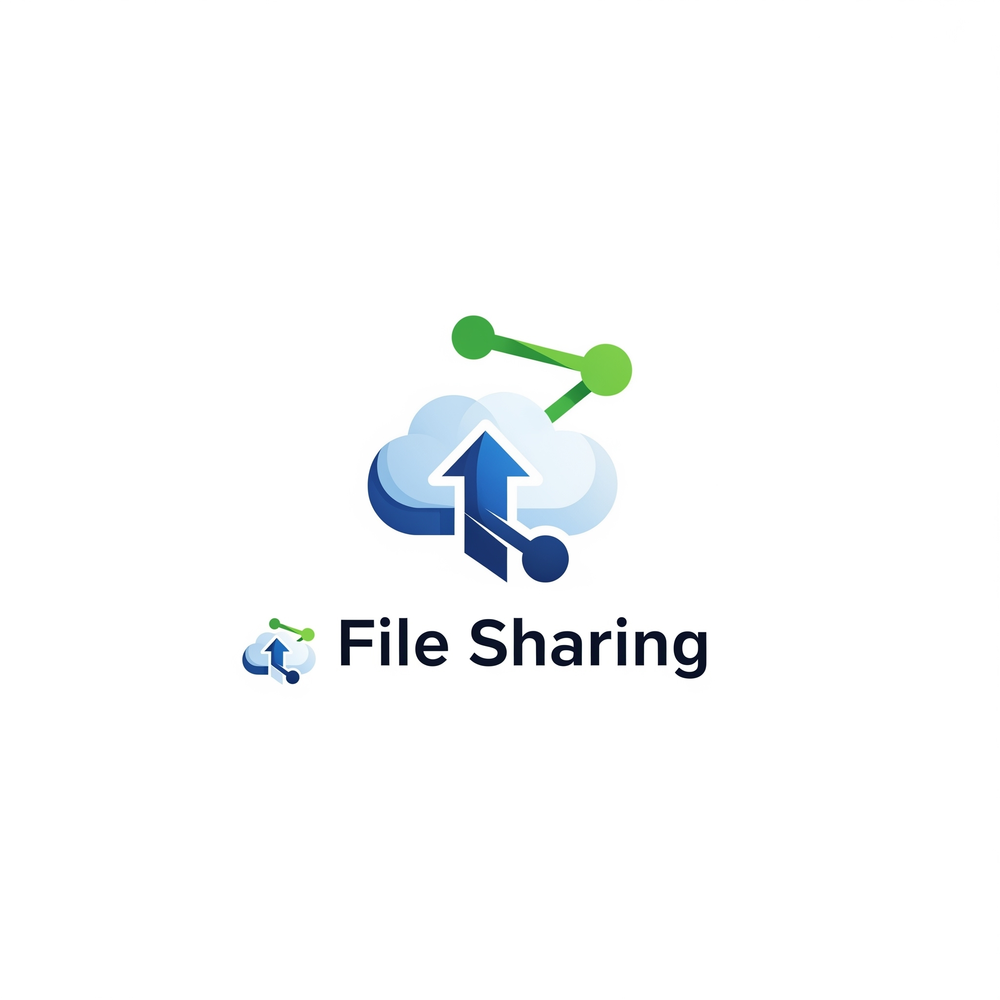

# Data Science Portfolio
---

## Machine Learning

### File Sharing Application

A file sharing application enables users to upload, download, and manage digital files securely and efficiently across devices. It incorporates user authentication, access control, and cloud-based storage to ensure seamless and secure sharing. Advanced features like file encryption, link expiration, and real-time activity tracking enhance security and usability.

  

